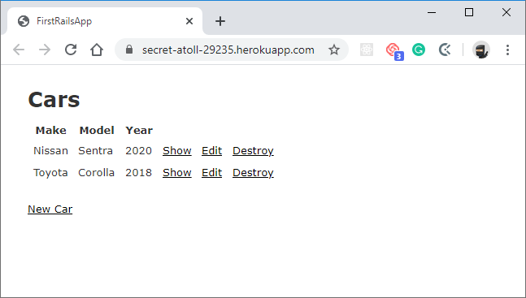

# My First Rails App

> This is my firs Rails Web App.



This is a basic CRUD to store information about cars' maker, model, and year of release.

## Built With

- Ruby language
- Ruby on Rails framework

## Live Demo

[Live Demo Link](https://secret-atoll-29235.herokuapp.com/)


## Getting Started

**To get a local copy up and running follow these simple example steps.**

### Prerequisites

* Ruby
* Rails
* Donwload this repo

### Setup

In order to run this project, you have to clone this repo.

```
git clone git@github.com:meme-es/first_rails_app.git
```

Install the required gems.

```
bundle install
```

If you experiment with some trouble installing gems, you should try installing one by one or download the gem and install it.

Migrate the database.

```
rails db:migrate
```

Finally, run the project.

```
rails server
```

And you will have a web server to store cars info in the http://localhost:3000/cars direction.

### Usage

This is a simple CRUD example on Rails to store cars info.

On the first page, you will see the info of cars' maker, model, and year of release, you can add, delete, see details, or modify the info for each item.


## Author

👤 **Manuel**

- Github: [@meme-es](https://github.com/meme-es)
- Twitter: [@meme_es](https://twitter.com/meme_es)
- Linkedin: [linkedin](https://www.linkedin.com/in/manuel-elias/)

## 🤝 Contributing

Contributions, issues and feature requests are welcome!

Feel free to check the [issues page](https://github.com/meme-es/first_rails_app/issues).

## Show your support

Give a ⭐️ if you like this project!

## 📝 License

This project is not licensed.
